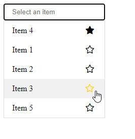

# Select Autocomplete Favorites

An autocomplete input, populated from a list.
It selects automatically the first matched item.
You can also add items to favorites, so they appear first and are autocompleted first.

# Example

.

See [the live codepen](https://codepen.io/J-r-my-Rossignol/pen/LYowaNj).

Or clone the repository and see the [/example](https://github.com/JeremyRossignol/Select_Autocomplete_Favorites/tree/master/example) folder.

## How to use

```js
document.addEventListener('DOMContentLoaded', () => {
   options = {
      idDiv: "#SAF",
      items: [
         { value: '1', text: 'Item 1', favorite: false },
         { value: '2', text: 'Item 2', favorite: false },
         { value: '3', text: 'Item 3', favorite: false },
         { value: '4', text: 'Item 4', favorite: false },
         { value: '5', text: 'Item 5', favorite: false }
      ],
      placeholder : 'Select an item',
      onStarItem : (event) => {
         console.log("item starred");
      },
      classAutocomplete : 'saf-autocomplete-input',
      classItems : 'saf-select-items',
      classSelect : 'saf-custom-select',
      classStarButton : 'saf-star-button'
   };
   const selectAutocompleteFavorite = new SelectAutocompleteFavorite(options);
})
```

## Options

- **idDiv (*)** : The id of the div to use to generate the select
- **items (*)** : the item array : ex : [{ value: '1', text: 'Item 1', favorite: false } ]
- **placeholder** : The placeholder in the input
- **onStarItem** : The function to call on a star item event
- **classAutocomplete** : Not implemented yet.
- **classItems** : Not implemented yet.
- **classSelect** : Not implemented yet.
- **classStarButton** : Not implemented yet.

## TODO

- customizable css